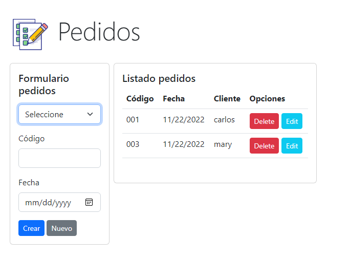

# Projecto Pedido Prueba Técnica

Computer Version:

[](https://www.microsoft.com/es-es/windows/windows-11?r=1)
[](https://ubuntu.com/)
[](https://www.apple.com/la/mac/)

> <strong> Projecto de pedido de cliente, usamos node js express para backend - frontend. </strong>



[](https://expressjs.com/es/)
[](https://www.javascript.com/)
[](https://www.npmjs.com/)
[](https://nodejs.org/es/)
[](https://www.mysql.com/)
[](https://github.com/)
[](https://git-scm.com/)
[](https://www.linux.org/)
[](https://www.microsoft.com/es-es/windows/windows-11?r=1)
[](https://code.visualstudio.com/)

## 💻 Pre requirementos


Para usar en su máquina local, el proyecto debe tener lo siguiente:

- Tener instalado NODE JS en la version 14 en adelante y MYSQL version 5.8.

## 🌐 Base de datos <proyecto_pedido_CJCHS>


Antes de usar el proyecto <proyecto_pedido_CJCHS>, usted debe seguir los siguientes pasos:

1. Importar el script de la base de datos en su gestor de MYSQL, este script se encuentra en la ruta del proyecto:
   ```
   db/script.sql
   ```
2. Crear un archivo de variables de entorno <.env> en la raiz del proyecto, aqui coloque las credenciales de conexión de su MYSQL y un puerto por defecto para la ejecución del servidor:
   ```
   PORT=9000
   DB_HOST=localhost
   DB_PORT=3306
   DB_SCHEMA=db_pedidos
   DB_USER=root
   DB_PASSWORD=root
   ```

## ☕ Requirementos <node_webtasks>


Para iniciar el servidor del proyecto <proyecto_pedido_CJCHS>, usted debe realizar los siguientes pasos:

1. Abrir una terminal en la raiz del proyecto.
2. En la raiz del proyecto ejecute lo siguiente:

   ```
   npm install
   ```

3. Despues inicie el servidor con lo siguiente:

   ```
   npm run dev
   ```

## 🚀 Iniciar proyecto <proyecto_pedido_CJCHS>

Ingrese a la ruta principal del proyecto <proyecto_pedido_CJCHS>, con lo siguiente:

- Abrir con su navegador por defecto:
  - 🌐 [http:/127.0.0.1:9000/](http://127.0.0.1:9000/)

<div align="center">

### My social accounts


[](https://twitter.com/harlericho)
[](https://github.com/harlericho)
[](https://hub.docker.com/u/harlericho)
[](https://harlericho.tech)

</div>

<p align="center"><strong>Copyright © 2022 Harlericho</strong></p>
